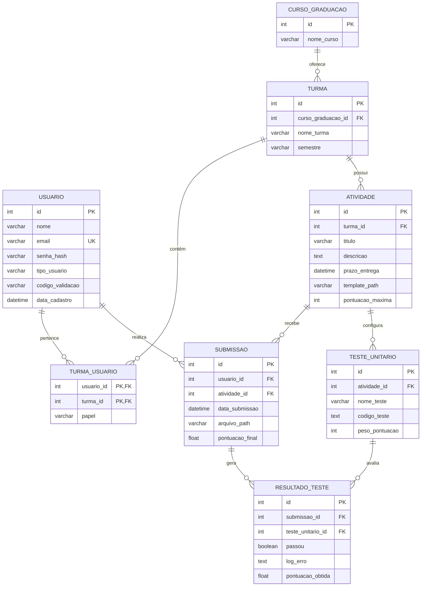
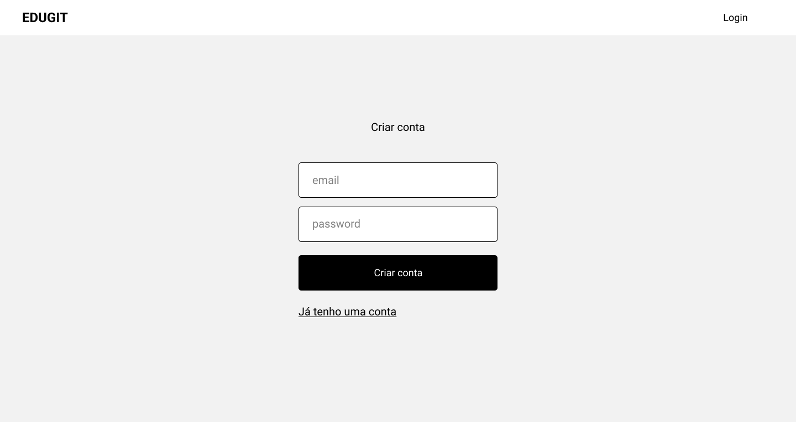
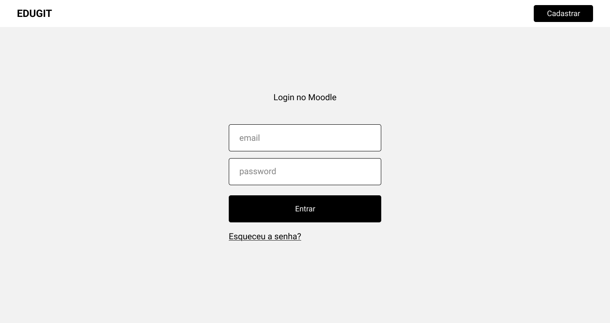
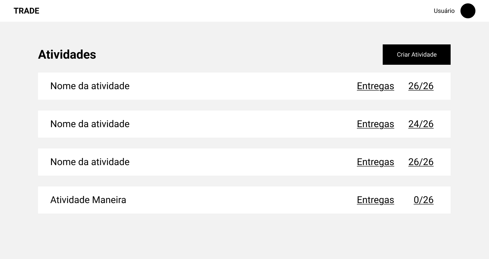
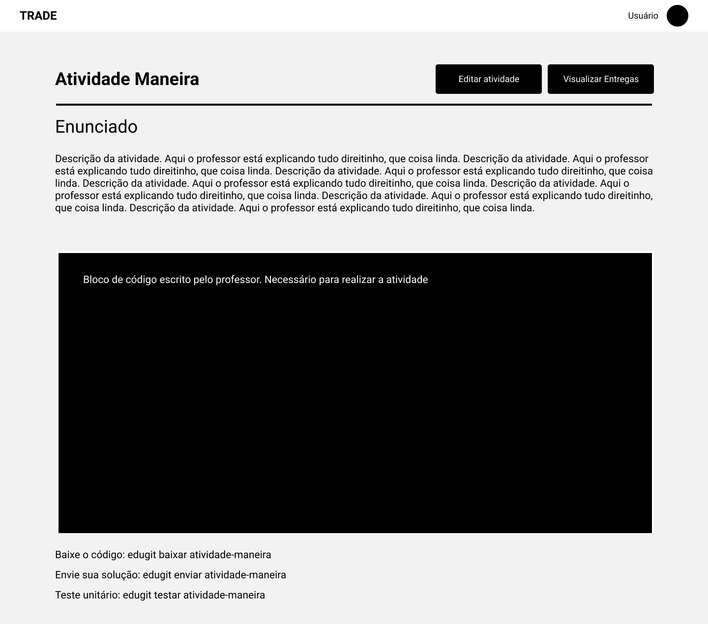
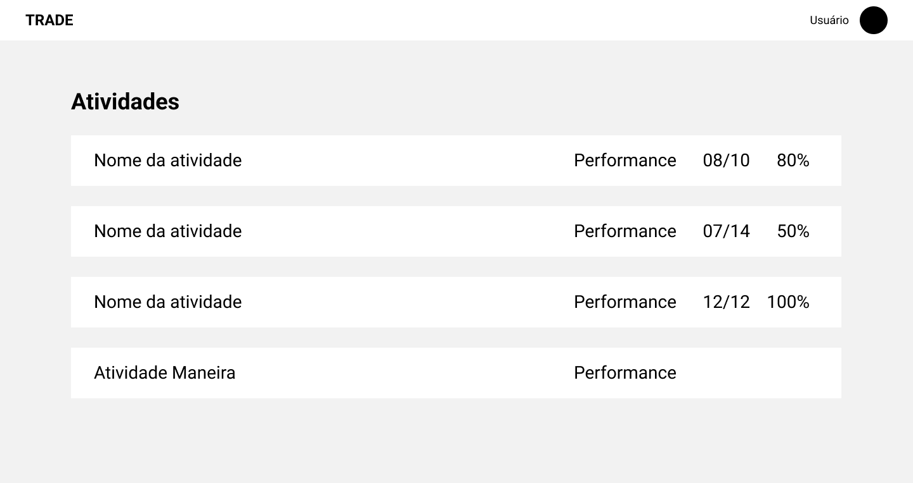
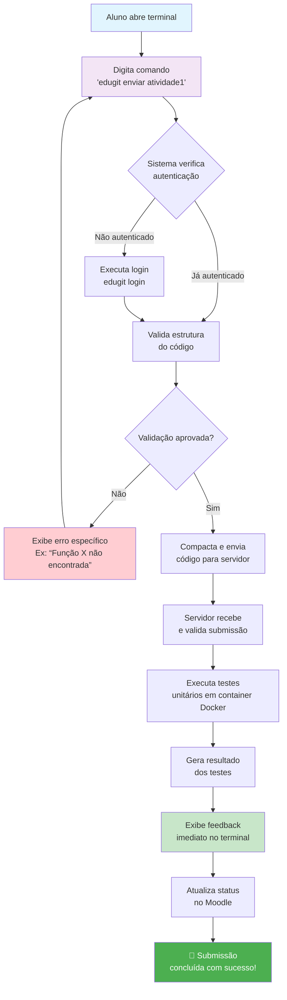
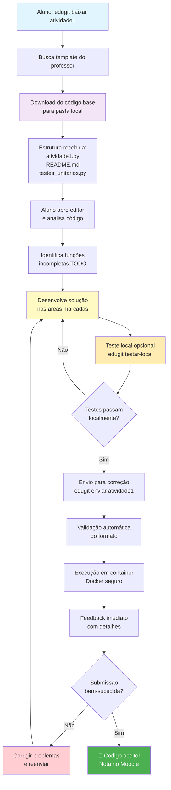
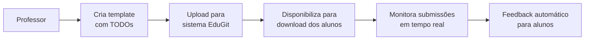

# EduGit – Plug-in do Moodle simulando Github
### Especificação e Protótipo
Grupo nº Infinito

**Integrantes**
Daniel Ferreira Alves - dandastico.bsb@gmail.com

**Prof. Orientador**
MSc. Edilberto M. Silva - prof.edilberto.silva@gmail.com

**11/2025**

## 1. INTRODUÇÃO
O presente documento constitui o Plano de Projeto para o desenvolvimento do EduGit, um plug-in educacional para a plataforma Moodle. O objetivo primordial deste projeto é aprimorar a gestão e o fluxo de trabalho de atividades práticas de programação no ambiente acadêmico, especificamente para alunos e professores da Faculdade SENAC-DF.

O EduGit propõe-se a ser **um sistema de controle de versão simplificado**, integrado ao Moodle, que visa organizar e gerenciar os códigos-fonte desenvolvidos por alunos em suas atividades. Sua funcionalidade central reside na capacidade de simular um repositório na nuvem, similar ao GitHub, permitindo que os alunos submetam suas soluções via comandos simplificados de terminal.

Um diferencial estratégico do EduGit é a incorporação de uma **plataforma de testes automatizados**. Esta funcionalidade permitirá aos professores configurar testes unitários que serão executados automaticamente contra o código submetido pelos alunos. Este mecanismo tem o propósito de acelerar significativamente o processo de correção das atividades e fornecer feedback imediato e objetivo aos estudantes, alinhando-se a modelos de ensino de programação de alta performance.

Este Plano de Projeto detalha o escopo, os objetivos de alto nível, os requisitos funcionais, a estrutura de trabalho e o cronograma proposto para a entrega da primeira versão funcional do EduGit até o final do semestre letivo vigente (27/11/2025). O sucesso do projeto será medido pela sua capacidade de fornecer uma ferramenta robusta e eficiente que otimize o processo de ensino-aprendizagem de programação na instituição


## 2. DESCRIÇÃO DO PROJETO

### 2.1. Título do Projeto
EduGit

### 2.2. Objetivos de Alto Nível
- PARA alunos e professores de programação da Faculdade SENAC-DF 
- QUE necessitam de uma forma mais eficiente e organizada de gerenciar o envio e correção de atividades práticas de código, O EduGit É um plug-in para Moodle que atua como um sistema de controle de versão educacional,
- DIFERENTEMENTE DO GitHub tradicional que é genérico e não integrado com correção automática, 
- NOSSO PRODUTO oferece integração nativa com o Moodle, testes unitários automáticos configurados pelos professores e comando de envio simplificado via terminal, inspirado no modelo do CS50 de Harvard.
- QUANDO precisa estar pronto? A primeira versão funcional deve estar implementada até o final do semestre letivo vigente (27/11/2025).
- QUANTO é a previsão de custos? Investimento inicial estimado em R$ 4.000 considerando mão de obra especializada.

## 3. ESCOPO DO PROJETO
Funcionalidades Principais:
- Envio por Terminal: Comandos personalizados como "edugit enviar" para submissão das atividades
- Testes Automatizados: Execução de testes unitários configurados pelos professores
- Feedbak imediato: retorno automático sobre correção dos exercícios
- Integração ao Moodle: Sincronização com atividades e notas do Moodle
- Repositório central: Armazenamento seguro dos códigos dos alunos
- Templates Download: Distribuição de materiais base via comando terminal

Limitações:
- Versão 1.0: Suporte inicial apenas para Python
- Correção: Apenas testes automáticos - sem análise qualitativa de código (não verifica se segue padrões como "Código Limpo")
- Trabalho individual: Sem recursos para trabalhos em grupo
- Histórico: Versionamento básico, sem histórico detalhado de commits
- Interface: Foco no terminal, interface gráfica mínima

### 3.1. Escopo do Produto (Requisitos Funcionais)
- RF01 - Manter cadastro de usuário
  - RF01.1 - Consultar Usuário
  - RF01.2 - Cadastrar Usuário
  - RF01.3 - Validar Email
    - Gerar link de validação, enviar por email
  - RF01.4 - Editar Usuário


- RF02 - Gerenciar login do usuário
  - RF02.1 - Validar Credencial
  - RF02.2 - Redefinir Senha (esquecer a senha)


- RF03 - Gerenciar atividades
  - RF03.1 - Criar Atividade
  - RF03.2 - Editar Atividade
  - RF03.3 - Excluir Atividade
  - RF03.4 - Publicar/Ocultar Atividade
  - RF03.5 - Definir Prazo de Entrega
  - RF03.6 - Configurar Template Inicial
  - RF03.7 - Associar Testes Unitários à Atividade


- RF04 - Gerenciar Submissões de Código
  - RF04.1 - Enviar Código via Terminal
  - RF04.2 - Validar Formato do Código
  - RF04.3 - Listar Submissões por Aluno
  - RF04.4 - Download do Código Subetido


- RF05 - Executar Testes Automatizados
  - RF05.1 - Configurar Testes Unitários
  - RF05.2 - Executar Testes no Servidor
  - RF05.3 - Gerar Relatórios de Testes
  - RF05.4 - Definir Casos de Testes
  - RF05.5 - Calcular Pontuação Automática

### 3.2. Requisitos do Projeto

- RP01 - Delimitar o tema
- RP02 - Definir a equipe
- RP03 - Especificar atividades e Prazos
- RP04 - Definir Responsabilidades (RACI)
- RP05 - Gerenciar o acompanhamento do Projeto (kanban, Daily SCRUM, PO?)
- RP06 - Atualizar o Plano de Projeto


## 4. DIAGRAMA DE CASO DE USO


## 5. MODELO ENTIDADE E RELACIONAMENTO (MER)



## 6. ESPECIFICAÇÃO DOS REQUISITOS

**[RF01]** Manter cadastro de Usuário
Registrar novo usuário com gestão própria.

Este requisito descreve todos os passos para realização do cadastro de um novo usuário no sistema em que o usuário insere **nome, email e senha** (todos salvos no MySQL, senha criptografada).

Verificação do e-mail para certificar de que o usuário é o verdadeiro proprietário da conta. O processo inclui o envio de um código de verificação de 6 dígitos numéricos aleatórios para o email enviado, validação do código e a possibilidade de reenviar o código de verificação.

**Ator:** Aluno, Professor

**Prioridade:**
- (X) Essencial
- () Importante
- () Desejável

**RF01.1 Consultar Usuário**

Consultar Usuário Permite que o usuário visualize seus dados cadastrais.

**RF01.2 Cadastrar Usuário**

Permite a criação de um novo registro de usuário no sistema, incluindo a coleta de e-mail e senha.



**RF01.3 Validar Email**

Processo de segurança que envolve a de um link, enviado para o e-mail cadastrado pelo usuário, para confirmar o e-mail do usuário.


**RF01.4 Editar Usuário**

Permite a modificação dos dados cadastrais de um usuário existente, como email e senha.


**[RF02] Gerenciar login do usuário**

Permitir que usuários autenticados acessem as funcionalidades do sistema.

Este requisito abrange o processo de autenticação do usuário no sistema, garantindo que apenas usuários cadastrados e validados possam acessar as áreas restritas. Inclui a validação das credenciais (e-mail/senha) e o mecanismo de recuperação de senha.

**Ator:** Aluno, Professor

**Prioridade:**
- (X) Essencial
- ( ) Importante
- ( ) Desejável

**RF02.1 Validar Credencial**

O sistema deve verificar se o e-mail e a senha fornecidos pelo usuário correspondem a um registro válido no banco de dados. A senha deve ser comparada após a criptografia.



**RF02.2 Redefinir Senha (esquecer a senha)**

Permite que o usuário inicie um processo de recuperação de senha, geralmente envolvendo o envio de um link ou código de segurança para o e-mail cadastrado, para que possa definir uma nova senha.


**[RF03] Gerenciar atividades**

Permitir que o Professor crie, configure e gerencie as atividades acadêmicas que serão submetidas pelos alunos.

Este requisito é fundamental para o lado do Professor, permitindo a criação de um ambiente de submissão de código. O professor deve ser capaz de definir o escopo da atividade, o prazo, associar templates iniciais e configurar os testes unitários que serão usados na correção automática.

**Ator:** Professor

**Prioridade:**
- (X) Essencial
- ( ) Importante
- ( ) Desejável






**RF03.1 Criar Atividade**

Permite ao Professor definir o título, descrição e parâmetros básicos de uma nova atividade.

**RF03.2 Editar Atividade**

Permite ao Professor modificar os detalhes de uma atividade que ainda não foi publicada ou que precisa de ajustes.

**RF03.3 Excluir Atividade**

Permite a remoção de uma atividade do sistema, desde que não haja submissões associadas ou que a exclusão seja permitida pelas regras de negócio.

**RF03.4 Publicar/Ocultar Atividade**

Permite ao Professor controlar a visibilidade da atividade para os alunos, tornando-a disponível para submissão ou ocultando-a temporariamente.

**RF03.5 Definir Prazo de Entrega**

Permite ao Professor estabelecer a data e hora limite para a submissão dos códigos pelos alunos.

**RF03.6 Configurar Template Inicial**

Permite ao Professor anexar ou configurar um arquivo de código inicial (template) que os alunos poderão baixar via terminal para começar a atividade.

**RF03.7 Associar Testes Unitários à Atividade**

Permite ao Professor vincular um conjunto de testes unitários (scripts de teste) que serão executados automaticamente contra o código submetido pelo aluno.

**[RF04] Gerenciar Submissões de Código**

Permitir que o Aluno envie seu código para correção e que o Professor visualize e gerencie essas submissões.

Este requisito cobre o fluxo de trabalho principal do aluno, que é a submissão do código via terminal. Inclui a validação do formato do arquivo e a capacidade do Professor de listar e baixar os códigos submetidos.

**Ator:** Aluno, Professor

**Prioridade:**
- (X) Essencial
- ( ) Importante
- ( ) Desejável

**RF04.1 Enviar Código via Terminal**

Permite ao Aluno executar um comando simplificado (e.g., edugit enviar) no terminal para fazer o upload do seu arquivo de código para o repositório do EduGit.

```bash
>>> edugit enviar atividade-maneira
```
*Comando CLI inserido no terminal para enviar atividade*

**RF04.2 Validar Formato do Código**

O sistema deve verificar se o arquivo submetido está no formato esperado (inicialmente, apenas arquivos Python .py) e se atende a quaisquer outras regras de formato.

```bash
>>> Vertificando estrutura do código...
>>> Funções exigidas pela atividade encontradas...
>>> Envio concluído
```
*Resposta do sistema visto pelo terminal do código validado de acordo com template do professor*

```bash
>>> Verificando estrutura do código...
>>> Funcções exigidas não encontradas.
>>> Envio cancelado!
```
*Resposta do sistema visto pelo terminal quando o código não foi validado de acordo com o template do professor*

**RF04.3 Listar Submissões por Aluno**

Permite ao Professor visualizar um histórico de todas as submissões feitas por um aluno específico para uma determinada atividade.



**RF04.4 Download do Código Submetido**

Permite ao Professor baixar o arquivo de código submetido por um aluno para análise manual, se necessário.


```bash
>>> edugit baixar atividade-maneira <nome do aluno>
```
*Comando CLI para baixar código de um aluno específico, de uma atividade específica*

**[RF05] Executar Testes Automatizados**

Realizar a correção automática do código submetido pelo Aluno com base nos testes unitários configurados pelo Professor.

Este requisito é o cerne da proposta de valor do EduGit, que é acelerar a correção. Ele detalha o processo de configuração, execução e geração de feedback dos testes unitários.

**Ator:** Professor (Configuração), Sistema (Execução), Aluno (Visualização do Feedback)

**Prioridade:**
- (X) Essencial
- ( ) Importante
- ( ) Desejável

**RF05.1 Configurar Testes Unitários**

Permite ao Professor fazer o upload ou definir o código dos testes unitários que serão usados para avaliar as submissões.


*A inserção do código teste é realizado no mesmo local que a criação da ativdade, ou a edição dela*

**RF05.2 Executar Testes no Servidor**

O sistema deve ser capaz de rodar o código submetido pelo aluno em um ambiente seguro (sandbox) contra os testes unitários associados à atividade.

O teste pode ser realizado das seguintes maneiras:

1. Teste que não é armazenado em memória: comando é escrito no terminal na IDE compatível, o código é testado e o resultado é visualizado no terminal, podendo ver mais detalhes ao clicar no link. Esse teste não é armazenado a longo prazo na memória, o link da página é temporário.

```bash
>>> edugit testar atividade-maneira
Enviando código...
Testando código...
Recebendo resultados...
--------------------------------------
:) Solução de acordo com o template do professor
:) Solução retorna uma string
:) Solução retorna "Daniel"
:) Solução retorna "Carol"
:( Esperava retorno com valor "Edilberto", não "Silva"
Performance: 4/5
-> Mais informações: https://edugit.com.br/testes/atividade-maneira123846513518
```

2. Teste armazenado em memória: se o professor não tiver especificado os testes como privado até a data de correção do exercício, o aluno também recebe os resultados dos testes pelo terminal. Dessa vez, os códigos ficam armazenados em memória, podendo visualizar sua Performance durante todo o semestre.

```bash
>>> edugit enviar atividade-maneira
Enviando código...
Analisando código...
Código armazenado com sucesso!
Recebendo resultados...
--------------------------------------
:) Solução de acordo com o template do professor
:) Solução retorna uma string
:) Solução retorna "Daniel"
:) Solução retorna "Carol"
:( Esperava retorno com valor "Edilberto", não "Silva"
Performance: 4/5
-> Mais informações: https://edugit.com.br/testes/atividade-maneira123846513518
```

3. Teste efetuado em uma data especificada pelo professor, é armazenado em memória: caso o professor tenha especificado os testes unitários como privados, eles só serão efetuados e a Performance publicada após uma data especificada pelo professor, de maneira automática. Dessa maneira, a Performance da sua Solução só pode ser visualizada na página do Moodle, ela não é enviada para o terminal do aluno.

```bash
>>> edugit enviar atividade-maneira
Enviando código...
Código armazenado com sucesso!
A solução será corrigida em: 27/11/2025
``` 
*Mensagens no terminal após enviar a solução para uma atividade com os testes privados*


**RF05.3 Gerar Relatórios de Testes**

Após a execução, o sistema deve compilar um relatório detalhado indicando quais testes passaram e quais falharam, e a razão da falha.


*Relatório gerado pelo sistema, disponível no Moodle*

**RF05.4 Definir Casos de Testes**

Permite ao Professor especificar os diferentes cenários de entrada e saída esperada para cada teste unitário.

**RF05.5 Calcular Pontuação Automática**

Com base no número de testes unitários que passaram, o sistema deve calcular automaticamente uma pontuação para a submissão do aluno.


## 7. DIAGRAMA DE ATIVIDADES E FLUXOGRAMAS

#### Fluxograma para envio das soluções


#### Flucograma para escrever as soluções seguindo template do professor


#### Fluxograma do Professor


### Exemplificação do passo a passo do aluno pelo terminal
Download do template:
edugit baixar calculadora_basica

Navega para pasta:
cd calculadora_basica

Abre no editor (exemplo):
code atividade1.py
(Desenvolve a solução - aluno implementa as funções TODOs)

Testa localmente (opcional):
edugit testar

Envia para correção:
edugit enviar calculadora_basica