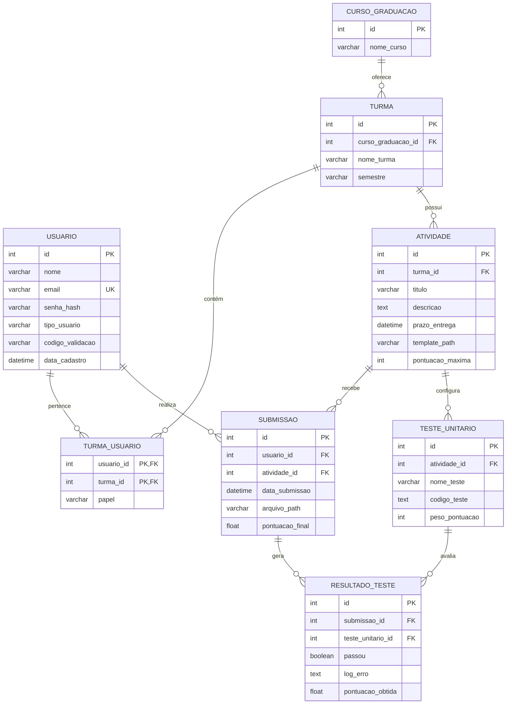
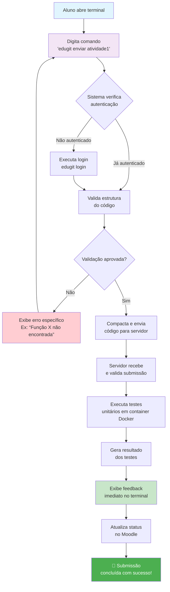
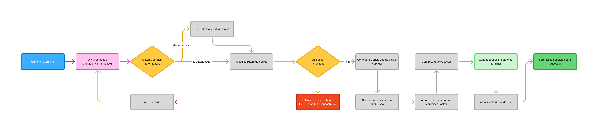
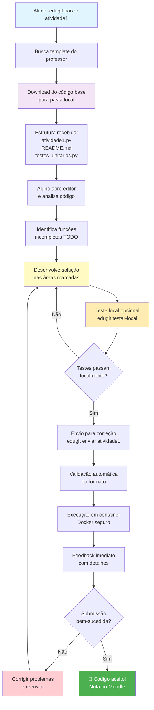
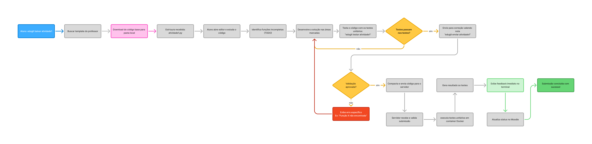
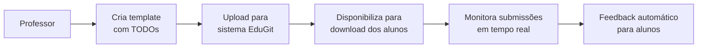

# EduGit – Plug-in do Moodle simulando Github
### Especificação e Protótipo
Grupo nº Infinito

**Integrantes**
Daniel Ferreira Alves - dandastico.bsb@gmail.com

**Prof. Orientador**
MSc. Edilberto M. Silva - prof.edilberto.silva@gmail.com

**11/2025**

## 1. INTRODUÇÃO
O presente documento constitui o Plano de Projeto para o desenvolvimento do EduGit, um plug-in educacional para a plataforma Moodle. O objetivo primordial deste projeto é aprimorar a gestão e o fluxo de trabalho de atividades práticas de programação no ambiente acadêmico, especificamente para alunos e professores da Faculdade SENAC-DF.

O EduGit propõe-se a ser **um sistema de controle de versão simplificado**, integrado ao Moodle, que visa organizar e gerenciar os códigos-fonte desenvolvidos por alunos em suas atividades. Sua funcionalidade central reside na capacidade de simular um repositório na nuvem, similar ao GitHub, permitindo que os alunos submetam suas soluções via comandos simplificados de terminal.

Um diferencial estratégico do EduGit é a incorporação de uma **plataforma de testes automatizados**. Esta funcionalidade permitirá aos professores configurar testes unitários que serão executados automaticamente contra o código submetido pelos alunos. Este mecanismo tem o propósito de acelerar significativamente o processo de correção das atividades e fornecer feedback imediato e objetivo aos estudantes, alinhando-se a modelos de ensino de programação de alta performance.

Este Plano de Projeto detalha o escopo, os objetivos de alto nível, os requisitos funcionais, a estrutura de trabalho e o cronograma proposto para a entrega da primeira versão funcional do EduGit até o final do semestre letivo vigente (27/11/2025). O sucesso do projeto será medido pela sua capacidade de fornecer uma ferramenta robusta e eficiente que otimize o processo de ensino-aprendizagem de programação na instituição


## 2. DESCRIÇÃO DO PROJETO

### 2.1. Título do Projeto
EduGit

### 2.2. Objetivos de Alto Nível
- PARA alunos e professores de programação da Faculdade SENAC-DF 
- QUE necessitam de uma forma mais eficiente e organizada de gerenciar o envio e correção de atividades práticas de código, O EduGit É um plug-in para Moodle que atua como um sistema de controle de versão educacional,
- DIFERENTEMENTE DO GitHub tradicional que é genérico e não integrado com correção automática, 
- NOSSO PRODUTO oferece integração nativa com o Moodle, testes unitários automáticos configurados pelos professores e comando de envio simplificado via terminal, inspirado no modelo do CS50 de Harvard.
- QUANDO precisa estar pronto? A primeira versão funcional deve estar implementada até o final do semestre letivo vigente (27/11/2025).
- QUANTO é a previsão de custos? Investimento inicial estimado em R$ 4.000 considerando mão de obra especializada.

## 3. ESCOPO DO PROJETO
Funcionalidades Principais:
- Envio por Terminal: Comandos personalizados como "edugit enviar" para submissão das atividades
- Testes Automatizados: Execução de testes unitários configurados pelos professores
- Feedbak imediato: retorno automático sobre correção dos exercícios
- Integração ao Moodle: Sincronização com atividades e notas do Moodle
- Repositório central: Armazenamento seguro dos códigos dos alunos
- Templates Download: Distribuição de materiais base via comando terminal

Limitações:
- Versão 1.0: Suporte inicial apenas para Python
- Correção: Apenas testes automáticos - sem análise qualitativa de código (não verifica se segue padrões como "Código Limpo")
- Trabalho individual: Sem recursos para trabalhos em grupo
- Histórico: Versionamento básico, sem histórico detalhado de commits
- Interface: Foco no terminal, interface gráfica mínima

### 3.1. Escopo do Produto (Requisitos Funcionais)
- RF01 - Manter cadastro de usuário
  - RF01.1 - Consultar Usuário
  - RF01.2 - Cadastrar Usuário
  - RF01.3 - Validar Email
    - Gerar link de validação, enviar por email
  - RF01.4 - Editar Usuário


- RF02 - Gerenciar login do usuário
  - RF02.1 - Validar Credencial
  - RF02.2 - Redefinir Senha (esquecer a senha)


- RF03 - Gerenciar atividades
  - RF03.1 - Criar Atividade
  - RF03.2 - Editar Atividade
  - RF03.3 - Excluir Atividade
  - RF03.4 - Publicar/Ocultar Atividade
  - RF03.5 - Definir Prazo de Entrega
  - RF03.6 - Configurar Template Inicial
  - RF03.7 - Associar Testes Unitários à Atividade


- RF04 - Gerenciar Submissões de Código
  - RF04.1 - Enviar Código via Terminal
  - RF04.2 - Validar Formato do Código
  - RF04.3 - Listar Submissões por Aluno
  - RF04.4 - Download do Código Submetido


- RF05 - Executar Testes Automatizados
  - RF05.1 - Configurar Testes Unitários
  - RF05.2 - Executar Testes no Servidor
  - RF05.3 - Gerar Relatórios de Testes
  - RF05.4 - Definir Casos de Testes
  - RF05.5 - Calcular Pontuação Automática

- RF06 - Gerenciar Repositório Local
  - RF06.1 - Iniciar Repositório

- RF07 - Gerenciar Área de Preparação (Staging)
  - RF07.1 - Adicionar Arquivos para Preparação

- RF08 - Gerenciar Histórico de Versões
  - RF08.1 - Gravar Alterações (Commit)
  - RF08.2 - Visualizar Histórico de Commits

- RF09 - Gerenciar Ramificações (Branches)
  - RF09.1 - Listar, Criar e Deletar Ramos
  - RF09.2 - Migrar entre Ramos

- RF10 - Inspecionar Estado do Repositório
  - RF10.1 - Verificar Estado do Diretório de Trabalho

### 3.2. Requisitos do Projeto

- RP01 - Delimitar o tema
- RP02 - Definir a equipe
- RP03 - Especificar atividades e Prazos
- RP04 - Definir Responsabilidades (RACI)
- RP05 - Gerenciar o acompanhamento do Projeto (kanban, Daily SCRUM, PO?)
- RP06 - Atualizar o Plano de Projeto


## 4. DIAGRAMA DE CASO DE USO


## 5. MODELO ENTIDADE E RELACIONAMENTO (MER)



## 6. ESPECIFICAÇÃO DOS REQUISITOS

**[RF01]** Manter cadastro de Usuário
Registrar novo usuário com gestão própria.

Este requisito descreve todos os passos para realização do cadastro de um novo usuário no sistema em que o usuário insere **nome, email e senha** (todos salvos no MySQL, senha criptografada).

Verificação do e-mail para certificar de que o usuário é o verdadeiro proprietário da conta. O processo inclui o envio de um código de verificação de 6 dígitos numéricos aleatórios para o email enviado, validação do código e a possibilidade de reenviar o código de verificação.

**Ator:** Aluno, Professor

**Prioridade:**
- (X) Essencial
- () Importante
- () Desejável

**RF01.1 Consultar Usuário**

Consultar Usuário Permite que o usuário visualize seus dados cadastrais.

1. O usuário acessa a seção "Meu Perfil" nna barra de navegação da plataforma EduGit.
2. O sistema exibe todas as informações do usuário selecionado, incluindo: nome completo, email, matrícula, tipo de usuário (aluno/professor), data de criação da conta, e status (ativo/inativo).
3. O usuário pode optar por editar ou excluir o perfil (se tiver permissão).

**Resultado Esperado:** O usuário consegue visualizar as informações do seu perfil de forma clara e organizada.

**RF01.2 Cadastrar Usuário**

Permite a criação de um novo registro de usuário no sistema, incluindo a coleta de e-mail e senha.

1. O usuário acessa a página inicial do EduGit e clica no botão "Criar Conta".
2. O sistema exibe um formulário de cadastro com os seguintes campos obrigatórios:
  - Email institucional (domínio @senac-df.edu.br)
  - Senha (com requisitos de segurança: mínimo 8 caracteres, incluindo letras maiúsculas, minúsculas, números e caracteres especiais)
  - Confirmação de senha
3. O usuário preenche todos os campos do formulário.
4. O sistema valida os dados em tempo real (veja RF01.3 para detalhes de validação).
5. Se todos os dados forem válidos, o usuário clica no botão "Criar Conta".
6. O sistema cria um registro do usuário no banco de dados com status "Pendente de Validação de Email".
7. O sistema envia um email de confirmação para o endereço fornecido, contendo um link de validação com validade de 24 horas.
8. O usuário recebe uma mensagem na tela informando que um email de confirmação foi enviado.

**Resultado Esperado:** Uma nova conta de usuário é criada e um email de confirmação é enviado para o endereço fornecido.


**RF01.3 Validar Email**

Processo de segurança que envolve a de um link, enviado para o e-mail cadastrado pelo usuário, para confirmar o e-mail do usuário.

1. Durante o cadastro (RF01.2), o usuário insere um endereço de email.

2. O sistema valida o formato do email em tempo real, verificando se:
  - O email contém um "@" seguido de um domínio válido.
  - O domínio é "@senac-df.edu.br" (validação de domínio institucional).
  - O email não está registrado em outra conta ativa no sistema.
3. Se o email for inválido ou já registrado, o sistema exibe uma mensagem de erro clara (ex: "Email inválido" ou "Este email já está registrado").
4. Se o email for válido, o usuário continua o processo de cadastro.
5. Após a criação da conta, o sistema gera um token único de validação com validade de 24 horas.
6. O sistema envia um email para o endereço fornecido contendo:
  -Um link de confirmação (ex: https://edugit.senac-df.edu.br/validar-email?token=abc123xyz )
  - Uma mensagem explicativa sobre a necessidade de validação.
7. O usuário clica no link de confirmação no email.
8. O sistema valida o token e marca o email como "Confirmado" no banco de dados.
9. O usuário recebe uma mensagem de sucesso e pode fazer login normalmente.

**Resultado Esperado:** O email do usuário é validado e confirmado, permitindo o acesso pleno à plataforma.


**RF01.4 Editar Usuário**

Permite a modificação dos dados cadastrais de um usuário existente, como email e senha.

1. O usuário acessa a seção "Meu Perfil" no menu da plataforma.
2. O sistema exibe um formulário pré-preenchido com as informações atuais do usuário.
3. O usuário identifica qual campo deseja modificar (ex: nome, email, senha).
4. O usuário altera o(s) campo(s) desejado(s).
5. Se o usuário alterar a senha, o sistema solicita a senha atual para confirmação de identidade.
6. O usuário clica no botão "Salvar Alterações".
7. O sistema valida os novos dados (aplicando as mesmas regras de validação de RF01.3 para email, se aplicável).
8. Se houver erros de validação, o sistema exibe mensagens de erro específicas.
9. Se os dados forem válidos, o sistema atualiza o registro do usuário no banco de dados.
10. O usuário recebe uma mensagem de confirmação: "Perfil atualizado com sucesso".

**Resultado Esperado:** As informações do usuário são atualizadas no sistema e refletidas imediatamente em seu perfil.


**[RF02] Gerenciar login do usuário**

Permitir que usuários autenticados acessem as funcionalidades do sistema.

Este requisito abrange o processo de autenticação do usuário no sistema, garantindo que apenas usuários cadastrados e validados possam acessar as áreas restritas. Inclui a validação das credenciais (e-mail/senha) e o mecanismo de recuperação de senha.

**Ator:** Aluno, Professor

**Prioridade:**
- (X) Essencial
- ( ) Importante
- ( ) Desejável

**RF02.1 Validar Credencial**

O sistema deve verificar se o e-mail e a senha fornecidos pelo usuário correspondem a um registro válido no banco de dados. A senha deve ser comparada após a criptografia.

1. O usuário acessa a página de login do EduGit.
2. O sistema exibe um formulário com dois campos: "Email" e "Senha".
3. O usuário insere seu email institucional (ex: joao.silva@senac-df.edu.br).
4. O usuário insere sua senha.
5. O usuário clica no botão "Entrar".
6. O sistema valida o email:
  - Verifica se o email existe no banco de dados.
  - Verifica se o email foi validado (confirmado via link de validação).
  - Verifica se a conta está ativa (não foi excluída ou desativada).
7. Se o email for inválido ou não encontrado, o sistema exibe a mensagem: "Email ou senha incorretos" (sem especificar qual é inválido, por segurança).
8. Se o email for válido, o sistema valida a senha:
  - Compara a senha fornecida com o hash armazenado no banco de dados.
9. Se a senha for incorreta, o sistema exibe a mensagem: "Email ou senha incorretos".
10. Se a senha for correta, o sistema:
  - Cria uma sessão para o usuário.
  - Armazena um token de autenticação (JWT ou similar) no navegador do usuário.
  - Registra o login no histórico de atividades do usuário.
  - Redireciona o usuário para o dashboard principal.

**Resultado Esperado:** O usuário é autenticado e pode acessar a plataforma EduGit.


**RF02.2 Redefinir Senha (esquecer a senha)**

Permite que o usuário inicie um processo de recuperação de senha, geralmente envolvendo o envio de um link ou código de segurança para o e-mail cadastrado, para que possa definir uma nova senha.

1. O usuário acessa a página de login e clica no link "Esqueci minha senha".
2. O sistema exibe um formulário solicitando o email do usuário.
3. O usuário insere seu email institucional.
4. O usuário clica em "Enviar Link de Redefinição".
5. O sistema verifica se o email existe no banco de dados:
  - Se não existir, o sistema exibe a mensagem: "Se este email estiver registrado, você receberá um link de redefinição" (mensagem genérica por segurança).
6. Se o email existir, o sistema:
  - Gera um token único de redefinição de senha com validade de 1 hora.
  - Envia um email para o usuário contendo:
  - Um link de redefinição (ex: https://edugit.senac-df.edu.br/redefinir-senha?token=xyz789abc )
  - Uma mensagem explicativa.
  - Um aviso de que o link expira em 1 hora.
7. O usuário recebe o email e clica no link de redefinição.
8. O sistema valida o token:
  - Verifica se o token é válido.
  - Verifica se o token não expirou.
9. Se o token for inválido ou expirado, o sistema exibe a mensagem: "Link inválido ou expirado. Solicite um novo link de redefinição".
10. Se o token for válido, o sistema exibe um formulário para o usuário inserir uma nova senha.
11. O usuário insere uma nova senha (seguindo os requisitos de segurança: mínimo 8 caracteres, incluindo letras maiúsculas, minúsculas, números e caracteres especiais).
12. O usuário clica em "Redefinir Senha".
13. O sistema valida a nova senha e a armazena no banco de dados (criptografada com hash).
14. O sistema exibe a mensagem: "Senha redefinida com sucesso. Você pode fazer login com sua nova senha".
15. O usuário é redirecionado para a página de login.


**[RF03] Gerenciar atividades**

Permitir que o Professor crie, configure e gerencie as atividades acadêmicas que serão submetidas pelos alunos.

Este requisito é fundamental para o lado do Professor, permitindo a criação de um ambiente de submissão de código. O professor deve ser capaz de definir o escopo da atividade, o prazo, associar templates iniciais e configurar os testes unitários que serão usados na correção automática.

**Ator:** Professor

**Prioridade:**
- (X) Essencial
- ( ) Importante
- ( ) Desejável


**RF03.1 Criar Atividade**

Permite ao Professor definir o título, descrição e parâmetros básicos de uma nova atividade.

1. O professor acessa o menu "Atividades" e clica em "Criar Nova Atividade".
2. O sistema exibe um formulário de criação com os seguintes campos:
  - Título da Atividade (obrigatório): ex: "Implementar Função de Ordenação"
  - Descrição (obrigatório): descrição detalhada do que o aluno deve fazer
  - Linguagem de Programação (obrigatório): seleção entre Python, Java, C++, etc. (inicialmente apenas Python)
  - Nível de Dificuldade (obrigatório): Fácil, Médio, Difícil
  - Prazo de Entrega (obrigatório): data e hora limite para submissão
  - Pontuação Máxima (obrigatório): valor em pontos (ex: 100)
3. O professor preenche todos os campos obrigatórios.
4. O professor clica em "Criar Atividade".
5. O sistema valida os dados:
  - Verifica se o título não está vazio.
  - Verifica se a descrição tem no mínimo 50 caracteres.
  - Verifica se o prazo é uma data futura.
  - Verifica se a pontuação é um número positivo.
6. Se houver erros de validação, o sistema exibe mensagens de erro específicas.
7. Se os dados forem válidos, o sistema:
  - Cria um novo registro de atividade no banco de dados com status "Rascunho".
  - Redireciona o professor para a página de edição da atividade.
  - Exibe a mensagem: "Atividade criada com sucesso. Agora você pode adicionar um template inicial e configurar testes".

**Resultado Esperado:** Uma nova atividade é criada no sistema com status "Rascunho" e pronta para ser configurada.

**RF03.2 Editar Atividade**

Permite ao Professor modificar os detalhes de uma atividade que ainda não foi publicada ou que precisa de ajustes.

1. O professor acessa o menu "Atividades" e seleciona uma atividade existente.
2. O sistema exibe a página de detalhes da atividade com um botão "Editar".
3. O professor clica em "Editar".
4. O sistema exibe um formulário pré-preenchido com os dados atuais da atividade.
5. O professor altera os campos desejados (título, descrição, prazo, pontuação, etc.).
6. O professor clica em "Salvar Alterações".
7. O sistema valida os dados (aplicando as mesmas regras de validação de RF03.1).
8. Se houver erros, o sistema exibe mensagens de erro.
9. Se os dados forem válidos, o sistema:
  - Atualiza o registro da atividade no banco de dados.
  - Exibe a mensagem: "Atividade atualizada com sucesso".
  - Nota: Se a atividade já foi publicada, o professor recebe um aviso de que as alterações afetarão os alunos já inscritos.

**Resultado Esperado:** Os detalhes da atividade são atualizados no sistema.


**RF03.3 Excluir Atividade**

Permite a remoção de uma atividade do sistema, desde que não haja submissões associadas ou que a exclusão seja permitida pelas regras de negócio.

1. O professor acessa o menu "Atividades" e seleciona uma atividade.
2. O sistema exibe a página de detalhes da atividade com um botão "Excluir".
3. O professor clica em "Excluir".
4. O sistema exibe um diálogo de confirmação: "Tem certeza que deseja excluir esta atividade? Esta ação é irreversível".
5. Se a atividade já possui submissões de alunos, o sistema exibe um aviso adicional: "Esta atividade possui X submissões. Ao excluir, todos os dados serão removidos".
6. O professor clica em "Confirmar Exclusão".
7. O sistema:
  - Remove o registro da atividade do banco de dados.
  - Remove todas as submissões de código associadas à atividade.
  - Remove todos os registros de testes executados para esta atividade.
  - Mantém um registro de auditoria.
8. O sistema exibe a mensagem: "Atividade excluída com sucesso".
9. O professor é redirecionado para a lista de atividades.

**Resultado Esperado:** A atividade é removida do sistema de forma irreversível.


**RF03.4 Publicar/Ocultar Atividade**

Permite ao Professor controlar a visibilidade da atividade para os alunos, tornando-a disponível para submissão ou ocultando-a temporariamente.

Descrição: Este requisito permite que um professor controle a visibilidade de uma atividade, tornando-a disponível ou indisponível para os alunos.

Ator Principal: Professor

Prioridade: Essencial

Passo-a-Passo:

1. O professor acessa o menu "Atividades" e seleciona uma atividade.

2. O sistema exibe a página de detalhes da atividade com um botão "Publicar" (se o status for "Rascunho") ou "Ocultar" (se o status for "Publicada").

3. Se o professor clicar em "Publicar":
  - O sistema verifica se a atividade possui um template inicial configurado (RF03.6).
  - O sistema verifica se a atividade possui pelo menos um teste unitário configurado (RF03.7).
  - Se alguma configuração obrigatória estiver faltando, o sistema exibe uma mensagem de erro indicando o que falta.
4. Se todas as configurações obrigatórias estiverem presentes, o professor clica em "Confirmar Publicação".
5. O sistema:
  - Altera o status da atividade para "Publicada".
  - Torna a atividade visível para todos os alunos da turma.
  - Registra a data e hora da publicação.
6. O sistema exibe a mensagem: "Atividade publicada com sucesso. Os alunos podem começar a trabalhar nela".
7. Se o professor clicar em "Ocultar":
  - O sistema altera o status da atividade para "Oculta".
  - A atividade fica invisível para os alunos (mas os dados históricos são preservados).
  - O sistema exibe a mensagem: "Atividade ocultada com sucesso".

**Resultado Esperado:** O status da atividade é alterado, controlando sua visibilidade para os alunos.


**RF03.5 Definir Prazo de Entrega**

Permite ao Professor estabelecer a data e hora limite para a submissão dos códigos pelos alunos.

1. Durante a criação (RF03.1) ou edição (RF03.2) de uma atividade, o professor preenche o campo "Prazo de Entrega".

2. O sistema exibe um seletor de data e hora, permitindo que o professor escolha:
  - A data limite (ex: 15/11/2025).
  - A hora limite (ex: 23:59).
3. O professor seleciona a data e hora desejadas.

4. O sistema valida se a data/hora é futura (não pode ser uma data passada).

5. Se a data for inválida, o sistema exibe a mensagem: "O prazo deve ser uma data futura".

6. Se a data for válida, o sistema armazena o prazo no banco de dados.

7. Quando o prazo se aproxima, o sistema pode enviar notificações automáticas aos alunos (funcionalidade opcional).

8. Após o prazo expirar, o sistema:
  - Impede que novos códigos sejam submetidos.
  - Exibe uma mensagem aos alunos: "O prazo para esta atividade expirou. Você não pode mais submeter soluções".
  - Permite que o professor ainda visualize e corrija as submissões existentes.

**Resultado Esperado:** O prazo de entrega é definido e o sistema controla as submissões com base nele.


**RF03.6 Configurar Template Inicial**

Permite ao Professor anexar ou configurar um arquivo de código inicial (template) que os alunos poderão baixar via terminal para começar a atividade.

1. Durante a criação ou edição de uma atividade, o professor acessa a seção "Template Inicial".

2. O sistema exibe um editor de código ou um campo de upload de arquivo.

3. O professor pode:
  - Opção A - Escrever o código diretamente: Digita ou cola o código do template no editor de código fornecido.
  - Opção B - Fazer upload de um arquivo: Clica em "Fazer Upload" e seleciona um arquivo .py do seu computador.

4. O professor insere o código do template (ex: uma função com assinatura definida, mas corpo vazio).

5. O professor clica em "Salvar Template".

6. O sistema valida o código:
  - Verifica se o arquivo é um arquivo Python válido (extensão .py).
  - Verifica se o código não contém erros de sintaxe (compilação básica).

7. Se houver erros de validação, o sistema exibe mensagens de erro.

8. Se o código for válido, o sistema:
  - Armazena o template no banco de dados.
  - Exibe a mensagem: "Template configurado com sucesso".

9. Quando um aluno inicia a atividade (RF04.1), o sistema fornece automaticamente uma cópia do template para que ele comece a trabalhar.

**Resultado Esperado:** Um template inicial é configurado e será fornecido aos alunos quando iniciarem a atividade.


**RF03.7 Associar Testes Unitários à Atividade**

Permite ao Professor vincular um conjunto de testes unitários (scripts de teste) que serão executados automaticamente contra o código submetido pelo aluno.

1. Durante a criação ou edição de uma atividade, o professor acessa a seção "Configurar Testes".

2. O sistema exibe uma interface para adicionar testes unitários.

3. O professor clica em "Adicionar Novo Teste".

4. O sistema exibe um formulário com os seguintes campos:
  - Nome do Teste (obrigatório): ex: "Teste de Entrada Válida"
  - Descrição (obrigatório): descrição do que o teste valida
  - Código do Teste (obrigatório): código Python do teste unitário (usando framework como unittest ou pytest)
  - Peso do Teste (obrigatório): percentual de pontuação (ex: 20%)

5. O professor preenche todos os campos.

6. O professor clica em "Salvar Teste".

7. O sistema valida o código do teste:
  - Verifica se é um código Python válido.
  - Verifica se o teste segue a estrutura esperada (ex: função que retorna True/False ou usa assertions).

8. Se houver erros, o sistema exibe mensagens de erro.

9. Se o código for válido, o sistema armazena o teste no banco de dados e associa à atividade.

10. O professor pode adicionar múltiplos testes para a mesma atividade.

11. O sistema verifica se a soma dos pesos de todos os testes é 100%.

12. Quando um aluno submeter código (RF04.1), os testes configurados serão executados automaticamente (RF05.2).

**Resultado Esperado:** Testes unitários são configurados e serão executados automaticamente nas submissões dos alunos.


**[RF04] Gerenciar Submissões de Código**

Permitir que o Aluno envie seu código para correção e que o Professor visualize e gerencie essas submissões.

Este requisito cobre o fluxo de trabalho principal do aluno, que é a submissão do código via terminal. Inclui a validação do formato do arquivo e a capacidade do Professor de listar e baixar os códigos submetidos.

**Ator:** Aluno, Professor

**Prioridade:**
- (X) Essencial
- ( ) Importante
- ( ) Desejável

**RF04.1 Enviar Código via Terminal**

Permite ao Aluno executar um comando simplificado (e.g., edugit enviar) no terminal para fazer o upload do seu arquivo de código para o repositório do EduGit.

```bash
>>> edugit enviar atividade-maneira
```
*Comando CLI inserido no terminal para enviar atividade*

1. O aluno acessa a atividade no EduGit, copia o comando CLI para baixar a atividade e a executa em seu terminal.

2. O sistema fornece ao aluno:
  - Um arquivo de template inicial (se configurado em RF03.6).
  - Instruções de como submeter o código.
  - Um token de autenticação único para a atividade.

3. O aluno trabalha localmente em seu computador, desenvolvendo a solução.

4. Quando o aluno termina, ele abre o terminal em seu computador.

5. O aluno navega até o diretório contendo seu código.

6.  aluno executa o comando de submissão fornecido pelo EduGit:

7. O cliente EduGit (instalado no computador do aluno) valida o arquivo (veja RF04.2).

8. Se o arquivo for válido, o cliente envia o código para o servidor EduGit via HTTPS.

9. O servidor recebe o código e:
  - Armazena o arquivo no sistema de arquivos do servidor (em um diretório específico para a submissão).
  - Cria um registro de submissão no banco de dados com:
    - ID da atividade
    - ID do aluno
    - Timestamp da submissão
    - Caminho do arquivo armazenado
    - Status: "Recebida"

10. O servidor inicia automaticamente a execução dos testes (RF05.2).

11. O cliente exibe uma mensagem de sucesso: "Código enviado com sucesso! Os testes estão sendo executados...".

12. O aluno pode verificar o status da submissão acessando a atividade no EduGit.

**Resultado Esperado:** O código do aluno é enviado com sucesso e os testes são iniciados automaticamente.


**RF04.2 Validar Formato do Código**

O sistema deve verificar se o arquivo submetido está no formato esperado (inicialmente, apenas arquivos Python .py) e se atende a quaisquer outras regras de formato.

```bash
>>> Vertificando estrutura do código...
>>> Funções exigidas pela atividade encontradas...
>>> Envio concluído
```
*Resposta do sistema visto pelo terminal do código validado de acordo com template do professor*

```bash
>>> Verificando estrutura do código...
>>> Funcções exigidas não encontradas.
>>> Envio cancelado!
```
*Resposta do sistema visto pelo terminal quando o código não foi validado de acordo com o template do professor*


1. Quando um aluno tenta enviar código via terminal (RF04.1), o cliente EduGit valida o arquivo localmente.

2. O sistema verifica:
  - Extensão do arquivo: Deve ser .py (para Python).
  - Tamanho do arquivo: Não deve exceder 10 MB.
  - Sintaxe Python: O arquivo deve ser um código Python válido (sem erros de sintaxe).
  - Presença de funções obrigatórias: Se o template definir funções que devem estar presentes, o sistema verifica se existem.

3. Se alguma validação falhar, o sistema exibe uma mensagem de erro específica:
  - "Arquivo inválido: extensão não é .py"
  - "Arquivo muito grande (máximo 10 MB)"
  - "Erro de sintaxe na linha X: ..."
  - "Função obrigatória 'funcao_principal' não encontrada"

4. Se todas as validações passarem, o arquivo é aceito e enviado ao servidor.

5. O servidor também realiza validações adicionais:
  - Verifica novamente a sintaxe.
  - Verifica se o arquivo não contém código malicioso (verificação básica).

6. Se o servidor detectar problemas, a submissão é rejeitada e o aluno recebe uma mensagem de erro.

**Resultado Esperado:** Apenas arquivos válidos são aceitos para submissão.


**RF04.3 Listar Submissões por Aluno**

Permite ao Professor visualizar um histórico de todas as submissões feitas por um aluno específico para uma determinada atividade.

1. O aluno acessa uma atividade no EduGit.

2. O aluno clica em "Meu Histórico de Submissões".

3. O sistema exibe uma tabela com todas as submissões do aluno para essa atividade, incluindo:
  - Data/Hora da Submissão: ex: "15/11/2025 14:30"
  - Status: "Recebida", "Testando", "Testes Concluídos", "Erro"
  - Pontuação: ex: "85/100" (se os testes foram executados)
  - Ações: Botão para visualizar detalhes, baixar código, visualizar relatório de testes

4. O aluno pode clicar em uma submissão específica para ver:
  - O código enviado.
  - O resultado detalhado dos testes (quais passaram, quais falharam).
  - Feedback automático sobre erros (se disponível).

5. O aluno pode fazer quantas submissões desejar até o prazo (RF03.5).

6. O sistema mantém um histórico completo de todas as submissões.

**Resultado Esperado:** O aluno pode visualizar todas as suas submissões e seus resultados.


**RF04.4 Download do Código Submetido**

Permite ao Professor baixar o arquivo de código submetido por um aluno para análise manual, se necessário.


```bash
>>> edugit baixar atividade-maneira <nome do aluno>
```
*Comando CLI para baixar código de um aluno específico, de uma atividade específica*

1. O aluno acessa o histórico de submissões (RF04.3) ou o professor acessa a lista de submissões de uma atividade.

2. O usuário seleciona uma submissão específica.

3. O sistema exibe os detalhes da submissão com um botão "Baixar Código" ou executa comando no terminal.

4. O usuário clica em "Baixar Código".

5. O sistema:
  - Recupera o arquivo de código do servidor de arquivos.
  - Comprime o arquivo (se necessário).
  - Inicia o download para o computador do usuário.

6. O arquivo é salvo com um nome descritivo, ex: atividade_10_joao_silva_15_11_2025.py.

7. O sistema registra o download no histórico de atividades (para auditoria).

**Resultado Esperado:** O arquivo de código é baixado com sucesso para o computador do usuário.


**[RF05] Executar Testes Automatizados**

Realizar a correção automática do código submetido pelo Aluno com base nos testes unitários configurados pelo Professor.

Este requisito é o cerne da proposta de valor do EduGit, que é acelerar a correção. Ele detalha o processo de configuração, execução e geração de feedback dos testes unitários.

**Ator:** Professor (Configuração), Sistema (Execução), Aluno (Visualização do Feedback)

**Prioridade:**
- (X) Essencial
- ( ) Importante
- ( ) Desejável

**RF05.1 Configurar Testes Unitários**

Permite ao Professor fazer o upload ou definir o código dos testes unitários que serão usados para avaliar as submissões.


*A inserção do código teste é realizado no mesmo local que a criação da ativdade, ou a edição dela*

1. O professor acessa uma atividade e clica em "Configurar Testes".

2. O sistema exibe uma interface para gerenciar testes (detalhes em RF03.7).

3. O professor pode:
  - Adicionar novos testes.
  - Editar testes existentes.
  - Remover testes.
  - Definir o peso de cada teste na pontuação final.

4. O professor clica em "Salvar Configuração de Testes".

5. O sistema valida a configuração:
  - Verifica se há pelo menos um teste configurado.
  - Verifica se a soma dos pesos é 100%.

6. Se houver erros, o sistema exibe mensagens de erro.

7. Se a configuração for válida, o sistema armazena os testes e ativa a execução automática.

**Resultado Esperado:** Os testes são configurados e prontos para serem executados nas submissões.


**RF05.2 Executar Testes no Servidor**

O sistema deve ser capaz de rodar o código submetido pelo aluno em um ambiente seguro (sandbox) contra os testes unitários associados à atividade.

O teste pode ser realizado das seguintes maneiras:

1. Teste que não é armazenado em memória: comando é escrito no terminal na IDE compatível, o código é testado e o resultado é visualizado no terminal, podendo ver mais detalhes ao clicar no link. Esse teste não é armazenado a longo prazo na memória, o link da página é temporário.

```bash
>>> edugit testar atividade-maneira
Enviando código...
Testando código...
Recebendo resultados...
--------------------------------------
:) Solução de acordo com o template do professor
:) Solução retorna uma string
:) Solução retorna "Daniel"
:) Solução retorna "Carol"
:( Esperava retorno com valor "Edilberto", não "Silva"
Performance: 4/5
-> Mais informações: https://edugit.com.br/testes/atividade-maneira123846513518
```

2. Teste armazenado em memória: se o professor não tiver especificado os testes como privado até a data de correção do exercício, o aluno também recebe os resultados dos testes pelo terminal. Dessa vez, os códigos ficam armazenados em memória, podendo visualizar sua Performance durante todo o semestre.

```bash
>>> edugit enviar atividade-maneira
Enviando código...
Analisando código...
Código armazenado com sucesso!
Recebendo resultados...
--------------------------------------
:) Solução de acordo com o template do professor
:) Solução retorna uma string
:) Solução retorna "Daniel"
:) Solução retorna "Carol"
:( Esperava retorno com valor "Edilberto", não "Silva"
Performance: 4/5
-> Mais informações: https://edugit.com.br/testes/atividade-maneira123846513518
```

3. Teste efetuado em uma data especificada pelo professor, é armazenado em memória: caso o professor tenha especificado os testes unitários como privados, eles só serão efetuados e a Performance publicada após uma data especificada pelo professor, de maneira automática. Dessa maneira, a Performance da sua Solução só pode ser visualizada na página do Moodle, ela não é enviada para o terminal do aluno.

```bash
>>> edugit enviar atividade-maneira
Enviando código...
Código armazenado com sucesso!
A solução será corrigida em: 27/11/2025
``` 
*Mensagens no terminal após enviar a solução para uma atividade com os testes privados*

1. Quando um aluno submete código (RF04.1), o servidor EduGit recebe o arquivo.

2. O servidor cria um ambiente isolado (sandbox/container) para executar os testes.

3. O servidor copia o arquivo de código do aluno para o ambiente isolado.

4. O servidor copia o arquivo de template (se houver) para o ambiente isolado.

5. O servidor copia os testes unitários configurados para o ambiente isolado.

6. O servidor executa cada teste unitário no ambiente isolado:
  - Executa o teste usando o framework Python (ex: pytest ou unittest).
  - Captura a saída do teste (stdout, stderr).
  - Registra o resultado (passou/falhou).
  - Registra o tempo de execução.

7. Se um teste falhar, o servidor captura a mensagem de erro.

8. Se um teste exceder um tempo limite de execução (ex: 30 segundos), o servidor interrompe a execução e marca como "Timeout".

9. O servidor limpa o ambiente isolado após a execução.

10. O servidor armazena os resultados no banco de dados.

11. O servidor inicia a geração do relatório de testes (RF05.3).

**Resultado Esperado:** Os testes são executados com segurança em um ambiente isolado e os resultados são registrados.


**RF05.3 Gerar Relatórios de Testes**

Após a execução, o sistema deve compilar um relatório detalhado indicando quais testes passaram e quais falharam, e a razão da falha.


*Relatório gerado pelo sistema, disponível no Moodle*

1. Após a execução dos testes (RF05.2), o servidor gera um relatório.

2. O relatório inclui:
  - Resumo Geral: Total de testes, testes aprovados, testes reprovados, taxa de sucesso (%).
  - Detalhes de Cada Teste:
  - Nome do teste.
  - Status (Passou/Falhou/Timeout).
  - Tempo de execução.
  - Mensagem de erro (se falhou).
  - Pontuação Obtida: ex: "85/100"
  - Feedback Automático: Sugestões de correção (se disponível).

3. O relatório é armazenado no banco de dados e associado à submissão.

4. O relatório é exibido ao aluno na interface web:
  - O aluno acessa o histórico de submissões (RF04.3).
  - O aluno clica em "Ver Relatório de Testes".
  - O sistema exibe o relatório em um formato legível e visual.

5. O professor também pode visualizar o relatório:
  - O professor acessa a lista de submissões de uma atividade.
  - O professor clica em uma submissão específica.
  - O sistema exibe o relatório detalhado.

6. O relatório pode ser exportado em formato PDF ou CSV (funcionalidade opcional).

**Resultado Esperado:** Um relatório detalhado dos testes é gerado e disponibilizado ao aluno e ao professor.


**RF05.4 Definir Casos de Testes**

Permite ao Professor especificar os diferentes cenários de entrada e saída esperada para cada teste unitário.

1. Durante a configuração de testes (RF05.1 ou RF03.7), o professor define casos de teste.

2. Para cada teste, o professor pode definir múltiplos casos de teste:
  - Entrada: Dados que serão passados para a função (ex: [3, 1, 4, 1, 5]).
  - Saída Esperada: O resultado esperado (ex: [1, 1, 3, 4, 5]).
  - Descrição: Uma descrição do caso (ex: "Teste com lista desordenada").

3. O professor pode adicionar quantos casos de teste desejar.

4. O professor clica em "Salvar Casos de Teste".

5. O sistema valida os casos de teste:
  - Verifica se a entrada e saída são válidas (formato correto).
  - Verifica se há pelo menos um caso de teste por teste unitário.

6. Se houver erros, o sistema exibe mensagens de erro.

7. Se forem válidos, o sistema armazena os casos de teste.

8. Durante a execução dos testes (RF05.2), cada caso de teste é executado:
  - A entrada é passada para a função do aluno.
  - A saída é comparada com a saída esperada.
  - O resultado é registrado.

**Resultado Esperado:** Casos de teste são definidos e executados para validar o código do aluno.


**RF05.5 Calcular Pontuação Automática**

Com base no número de testes unitários que passaram, o sistema deve calcular automaticamente uma pontuação para a submissão do aluno.

1. Após a execução de todos os testes (RF05.2), o servidor calcula a pontuação.

2. O cálculo é realizado da seguinte forma:
  - Para cada teste: Se o teste passou, o aluno recebe 100% do peso desse teste. Se falhou, recebe 0%.
  - Pontuação Total: Soma dos pesos de todos os testes aprovados.
  - Pontuação Final: (Pontuação Total / 100) × Pontuação Máxima da Atividade.

3. Exemplo:
  - Atividade com pontuação máxima de 100 pontos.
  - 5 testes, cada um com peso 20%.
  - Aluno passou em 4 testes (80%) e falhou em 1 (20%).
  - Pontuação Final = (80 / 100) × 100 = 80 pontos.

4. O servidor armazena a pontuação no banco de dados.

5. O servidor atualiza o livro de notas do Moodle (se integrado) com a pontuação.

6. O aluno visualiza sua pontuação:
  - No histórico de submissões (RF04.3).
  - No relatório de testes (RF05.3).

7. O professor visualiza as pontuações de todos os alunos:
  - Em um painel de notas da atividade.
  - Em um relatório geral da turma.

**Resultado Esperado:** A pontuação do aluno é calculada automaticamente com base no desempenho nos testes.

**[RF06]** Gerenciar Repositório Local

Permitir que o usuário crie e gerencie um repositório local para controle de versão de seus arquivos de projeto.

**Ator:** Aluno, Professor

**Prioridade:**
- (X) Essencial
- () Importante
- () Desejável

**RF06.1 Iniciar Repositório (`iniciar`)**

Permite a criação da estrutura de um novo repositório local.

1. O usuário abre o terminal na pasta do seu projeto.
2. O usuário executa o comando `python main.py iniciar`.
3. O sistema verifica se um repositório `edugit` já existe no diretório atual.
4. Se não existir, o sistema cria uma pasta chamada `edugit`.
5. Dentro de `edugit`, o sistema cria a estrutura de subpastas (`objects`, `refs/heads`) e arquivos (`HEAD`, `index`) necessários para o controle de versão.
6. O sistema exibe a mensagem: "Repositório Git vazio inicializado em /caminho/completo/edugit".

**Resultado Esperado:** Um novo repositório local é criado e está pronto para rastrear arquivos.

---

**[RF07]** Gerenciar Área de Preparação (Staging)

Permitir que o usuário selecione quais alterações nos arquivos devem ser incluídas no próximo commit.

**Ator:** Aluno, Professor

**Prioridade:**
- (X) Essencial
- () Importante
- () Desejável

**RF07.1 Adicionar Arquivos para Preparação (`adicionar`)**

Adiciona o conteúdo de arquivos específicos à área de preparação (staging area ou index).

1. O usuário modifica ou cria um ou mais arquivos no seu diretório de trabalho.
2. O usuário executa o comando `python main.py adicionar <caminho_do_arquivo_1> <caminho_do_diretorio_2>`.
3. Para cada caminho fornecido, o sistema lê o conteúdo do arquivo.
4. O sistema calcula o hash SHA-1 do conteúdo (criando um objeto "blob").
5. O sistema armazena o objeto blob na pasta `edugit/objects`.
6. O sistema atualiza o arquivo `edugit/index` para mapear o caminho do arquivo ao seu hash correspondente.
7. O sistema exibe a mensagem: "Adicionado <caminho_do_arquivo>".

**Resultado Esperado:** As alterações nos arquivos especificados são preparadas e estarão inclusas no próximo commit.

---

**[RF08]** Gerenciar Histórico de Versões

Permitir que o usuário salve snapshots do estado do projeto e visualize o histórico dessas alterações.

**Ator:** Aluno, Professor

**Prioridade:**
- (X) Essencial
- () Importante
- () Desejável

**RF08.1 Gravar Alterações (`gravar`)**

Cria um novo commit com as alterações que foram adicionadas à área de preparação (staging).

1. O usuário executa o comando `python main.py gravar -m "Sua mensagem de commit"`.
2. O sistema verifica se há alterações na área de preparação (index) para serem commitadas.
3. Se houver, o sistema cria um ou mais objetos "tree" a partir do index, representando a estrutura de diretórios do projeto.
4. O sistema cria um objeto "commit", que aponta para a "tree" raiz e para o commit anterior (pai). O objeto commit também armazena a mensagem, autor e data.
5. O hash do novo commit é calculado e o objeto é salvo em `edugit/objects`.
6. O sistema atualiza o ponteiro do branch atual (ex: `edugit/refs/heads/master`) para apontar para o novo hash de commit.
7. O sistema exibe a mensagem: "Commit <hash_do_commit> criado no branch <nome_do_branch>".

**Resultado Esperado:** Um snapshot permanente das alterações preparadas é salvo no histórico do repositório.

**RF08.2 Visualizar Histórico de Commits (`historico`)**

Exibe a lista de commits realizados no branch atual, do mais recente para o mais antigo.

1. O usuário executa o comando `python main.py historico`.
2. O sistema localiza o hash do commit atual lendo o ponteiro do branch (ex: `refs/heads/master`).
3. O sistema carrega o objeto do commit e exibe suas informações: hash, autor, data e mensagem.
4. O sistema segue para o commit pai e repete o processo, navegando pelo histórico.
5. A exibição continua até que não haja mais commits pais ou o limite de exibição seja atingido.

**Resultado Esperado:** O usuário consegue visualizar o histórico de alterações do projeto.

---

**[RF09]** Gerenciar Ramificações (Branches)

Permitir o trabalho em linhas de desenvolvimento isoladas (branches), podendo criá-las, deletá-las e alternar entre elas.

**Ator:** Aluno, Professor

**Prioridade:**
- (X) Essencial
- () Importante
- () Desejável

**RF09.1 Listar, Criar e Deletar Ramos (`ramo`)**

Gerencia os branches do repositório.

1. Para listar: O usuário executa `python main.py ramo`. O sistema lista todos os arquivos em `edugit/refs/heads` e marca o branch atual com um `*`.
2. Para criar: O usuário executa `python main.py ramo <novo_nome>`. O sistema cria um novo arquivo de ponteiro em `edugit/refs/heads/<novo_nome>` apontando para o mesmo commit do branch atual.
3. Para deletar: O usuário executa `python main.py ramo <nome_do_ramo> -d`. O sistema apaga o arquivo de ponteiro correspondente em `edugit/refs/heads`.

**Resultado Esperado:** O usuário pode gerenciar diferentes linhas de desenvolvimento de forma organizada.

**RF09.2 Migrar entre Ramos (`migrar`)**

Altera o branch ativo e atualiza os arquivos no diretório de trabalho para corresponder ao estado do novo branch.

1. O usuário executa o comando `python main.py migrar <nome_do_branch>`.
2. O sistema verifica se existem alterações não commitadas que seriam perdidas. Se sim, a operação é abortada com um aviso.
3. O sistema atualiza o arquivo `HEAD` para apontar para o novo branch (ex: `ref: refs/heads/<nome_do_branch>`).
4. O sistema lê o commit apontado pelo novo branch e sua árvore de arquivos.
5. O sistema limpa os arquivos do branch antigo e recria os arquivos e diretórios conforme o estado do commit do novo branch.
6. O sistema exibe a mensagem: "Alternado para o branch <nome_do_branch>".

**Resultado Esperado:** O diretório de trabalho do usuário é modificado para refletir o estado de um branch diferente.

---

**[RF10]** Inspecionar Estado do Repositório

Permitir que o usuário visualize o estado atual do seu diretório de trabalho e da área de preparação.

**Ator:** Aluno, Professor

**Prioridade:**
- (X) Essencial
- () Importante
- () Desejável

**RF10.1 Verificar Estado do Diretório de Trabalho (`estado`)**

Mostra o status dos arquivos no repositório.

1. O usuário executa o comando `python main.py estado`.
2. O sistema compara o estado de três "árvores": o último commit (HEAD), a área de preparação (index) e o diretório de trabalho atual.
3. O sistema identifica e lista:
    - Alterações a serem commitadas (arquivos diferentes entre o HEAD e o index).
    - Alterações não preparadas para commit (arquivos diferentes entre o index e o diretório de trabalho).
    - Arquivos não rastreados (arquivos no diretório de trabalho que não estão no index nem no HEAD).
    - Arquivos deletados.
4. As informações são exibidas de forma organizada para o usuário.

**Resultado Esperado:** O usuário obtém uma visão clara de quais arquivos foram modificados, quais estão prontos para commit e quais ainda não estão sendo rastreados.

## 7. DIAGRAMA DE ATIVIDADES E FLUXOGRAMAS

#### Fluxograma para envio das soluções





#### Flucograma para escrever as soluções seguindo template do professor




#### Fluxograma do Professor


### Exemplificação do passo a passo do aluno pelo terminal
Download do template:
edugit baixar calculadora_basica

Navega para pasta:
cd calculadora_basica

Abre no editor (exemplo):
code atividade1.py
(Desenvolve a solução - aluno implementa as funções TODOs)

Testa localmente (opcional):
edugit testar

Envia para correção:
edugit enviar calculadora_basica